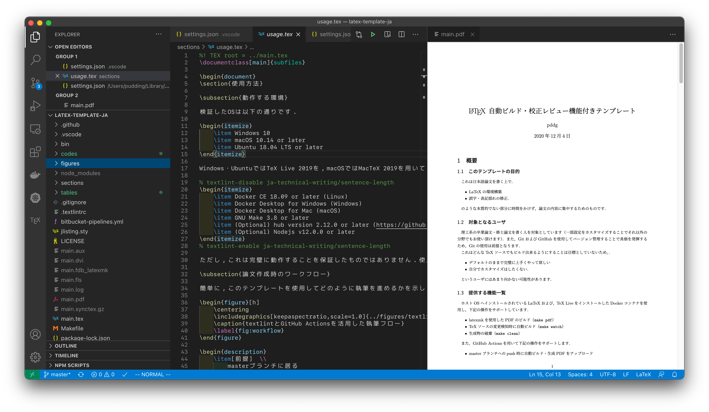

# 日本語論文をLaTeXで書いて、textlintをするためのテンプレート
[関連記事](https://qiita.com/k_uki512/items/728605e4dc25b2706baf)
## 使い方
### Dockerイメージのpull
　以下のコマンドを実行しLaTeXの環境構築がされたimageをローカルにpullします。

```
docker pull ghcr.io/being24/latex-docker:latest
```
pullできたかの確認
以下のコマンドを入力しimageの一覧を表示します。  
```
docker images
```
実行後に以下のものがあればpullは完了しています。  
```
ghcr.io/being24/latex-docker latest 36c0de73963d 3 months ago 1.65GB
```
### main.texの編集
編集が可能か確認を行うために、クローンしたディレクトリ内にある "main.tex" の編集を行います。
### docker imageの起動とpdfファイルの作成
作成したmain.texをpdfファイルに変換するために、先ほどpullした docker imageを起動します。
以下のコマンドを実行します。
```
docker run --rm --name latex-template-ja -it -v ${PWD}:/workdir ghcr.io/being24/latex-docker
```
dockerを起動している場合は、以下のコマンドを実行します。
```
docker exec -it latex-template-ja /bin/bash
```
コマンドの解説をします

```docker run``` : コンテナでコマンドを実行
```--rm``` ：コンテナの終了時にコンテナを削除
- ```name``` ：コンテナに名前を付ける（ここだと"latex-template-ja"）
- ```it``` ：コンテナ内に入りshellを起動する。
- ```v ${PWD}:/workdir```： ローカルのディレクトリをworkdirにマウントする。
実行後、コンテナ内のshellが起動されたら、以下のコマンドを実行します。
```
uplatex main.tex
```
このコマンドを実行することで、texファイルがコンパイルされdviファイルが作成されます。
今回だとmain.dviというファイルが作成されているか確認してください。  

　次に、今作成したdviファイルをpdfファイルに変換します。  
```
dvipdfmx main
```
このコマンドを実行することでdviファイルをpdfファイルに変換することができます。
### pdfファイルの確認
　作成されたpdfファイルを確認します。
## 機能

* 個人環境にLaTeX workshopを構築せず、dockerでビルドします
* GitHub Actionsを使用してtextlintを実行します
* github上にreleaseします
* レジュメや論文用のテンプレートを持ちますが、あくまで個人の環境用に構築したものです

## 環境

* Windows 10 or later
* macOS 10.14 or later
* Ubuntu 18.04 LTS or later

Docker環境が必要ですが、clsファイルについては多少弄ればCloud LaTeX等でも使用できます

* Docker Desktop for Mac 2.1 or later
* Docker 18.06 or later
* Docker Desktop for Windows

Ubuntu 20.04 LTS上の TeX Live 2022を使用します  
ビルド用のdocker imageは[こちらのリポジトリ](https://github.com/being24/latex-docker)を参照してください

また、VSCodeが必要です



## 使い方

使い方やFAQはこの[記事](https://zenn.dev/being/articles/how-to-use-my-latex)にまとめています

## License

CC0

## Author

Being

## config

VSCode上での設定例は[settings.json](.vscode/settings.json)を参照してください

## テンプレートについて

できるだけ現代的な設定を意識して作成したテンプレートですが、LaTeXに詳しいわけではないので誤りがあった場合は教えていただけると幸いです  
実際の使用時はexample等必要のないファイルは消してください

jlistingの代わりにmintedを使用し、参考文献はbiblatexを使用します
(mintedは環境によっては使用できないため、コメントアウトしてあります)

### resume.cls

[resume.cls](/classes/resume.cls)は2段組みのレジュメを作成するためのクラスファイルです  
使用方法は[例](/example/tex/resume_template.tex)を参照してください

### report.cls

[report.cls](/classes/report.cls)は論文を作成するためのクラスファイルです  
使用方法は[例](/example/tex/report_template.tex)を参照してください

### .vscode/settings.jsonについて

使用しやすい設定を参考程度ですが上げておきます。  
VSCodeであればこの設定を読み込んでくれるため、設定を変更する必要はありません

## 参考URL

<https://poyo.hatenablog.jp/entry/2020/12/05/110000>
